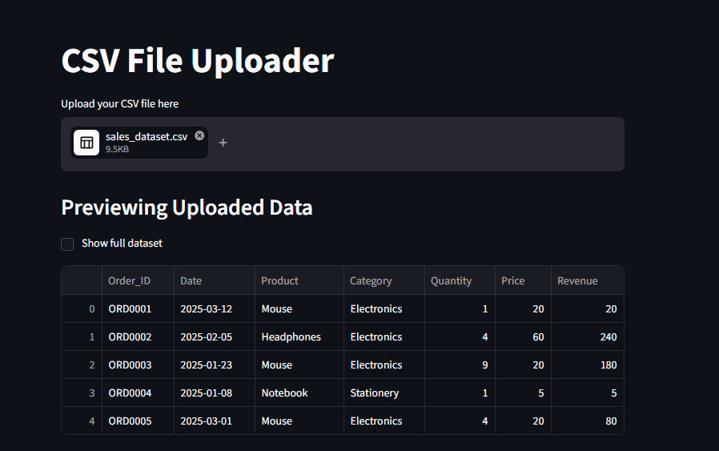
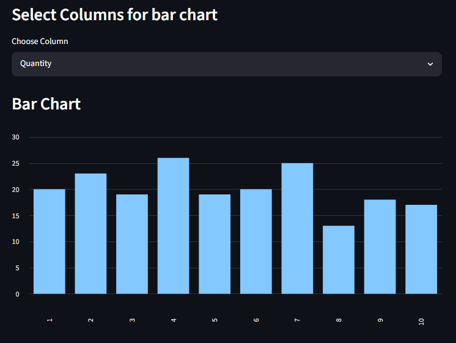
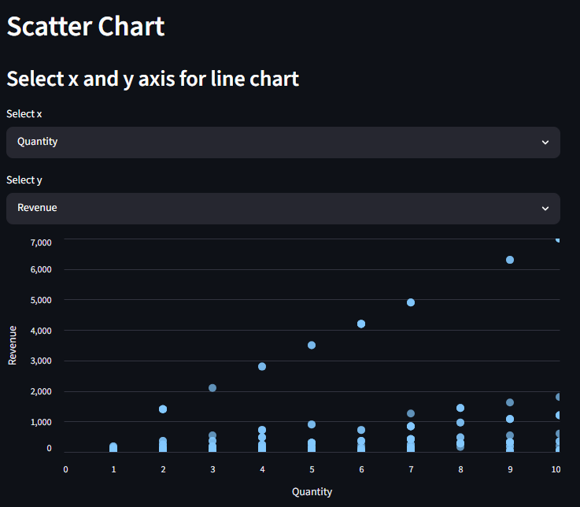
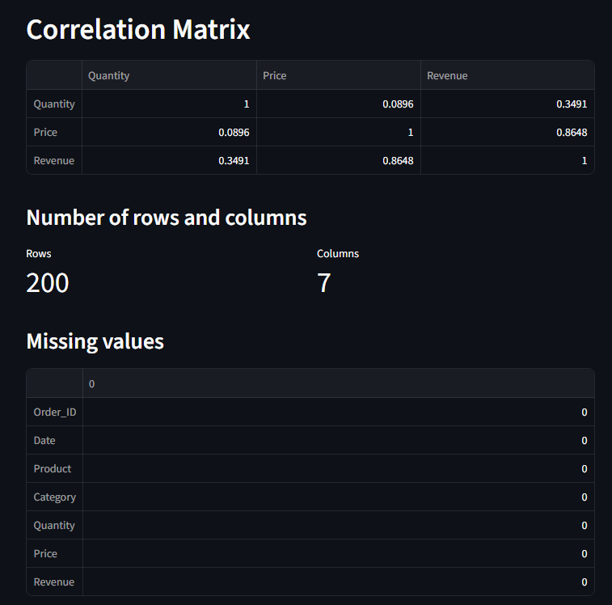
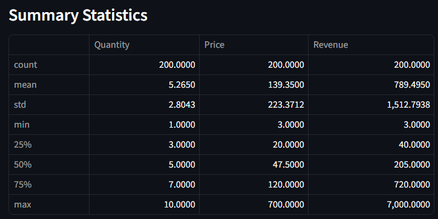

# 📈 CSV Data Explorer

An interactive CSV Data Explorer built with Streamlit and Pandas.

This application allows users to upload any CSV file and instantly explore the dataset through visualizations, summary statistics, correlation analysis, and data quality checks.

## Features

### CSV Upload

* Upload any CSV dataset
* Automatic data loading using Pandas
* Error handling for invalid files

### Dataset Preview

* Preview first few rows of data
* Option to display the complete dataset

### Dataset Information

* Total number of rows
* Total number of columns
* Interactive KPI cards

### Data Quality Analysis

* Missing value detection
* Dataset summary statistics
* Automatic numeric column detection

### Data Visualization

#### Bar Chart

* Select any numeric column
* Visualize column values interactively

#### Line Chart

* Select custom X-axis and Y-axis
* Compare numerical columns
* Validation to prevent duplicate axis selection

#### Correlation Matrix

* Analyze relationships between numerical features
* Automatically generated correlation table

## Tech Stack

* Python
* Streamlit
* Pandas

## Project Structure

```text
csv-data-explorer/
│
├── app.py
├── requirements.txt
└── README.md
```

## Installation

```bash
git clone https://github.com/yourusername/csv-data-explorer.git

cd csv-data-explorer

pip install -r requirements.txt

streamlit run app.py
```

## Usage

1. Launch the application.
2. Upload a CSV file.
3. Explore the dataset preview.
4. View dataset metrics.
5. Analyze missing values.
6. Generate visualizations.
7. Explore correlations between numerical features.

## Screenshots

### Dataset Preview



### Bar Chart Visualization



### Scatter Chart Visualization



### Correlation Matrix



### Statistical Stats



## Future Improvements

* Plotly interactive charts
* Heatmap visualization for correlation matrix
* Dataset filtering
* Column search
* Download cleaned dataset
* Automated data insights
* AI-powered data analysis

## Learning Outcomes

This project demonstrates:

* File handling
* Data cleaning concepts
* Exploratory Data Analysis (EDA)
* Data visualization
* Pandas operations
* Streamlit development

## Author

**Anmol Sharma**

AI/ML Student & Aspiring Machine Learning Engineer

GitHub: https://github.com/Anmol-Sudo
